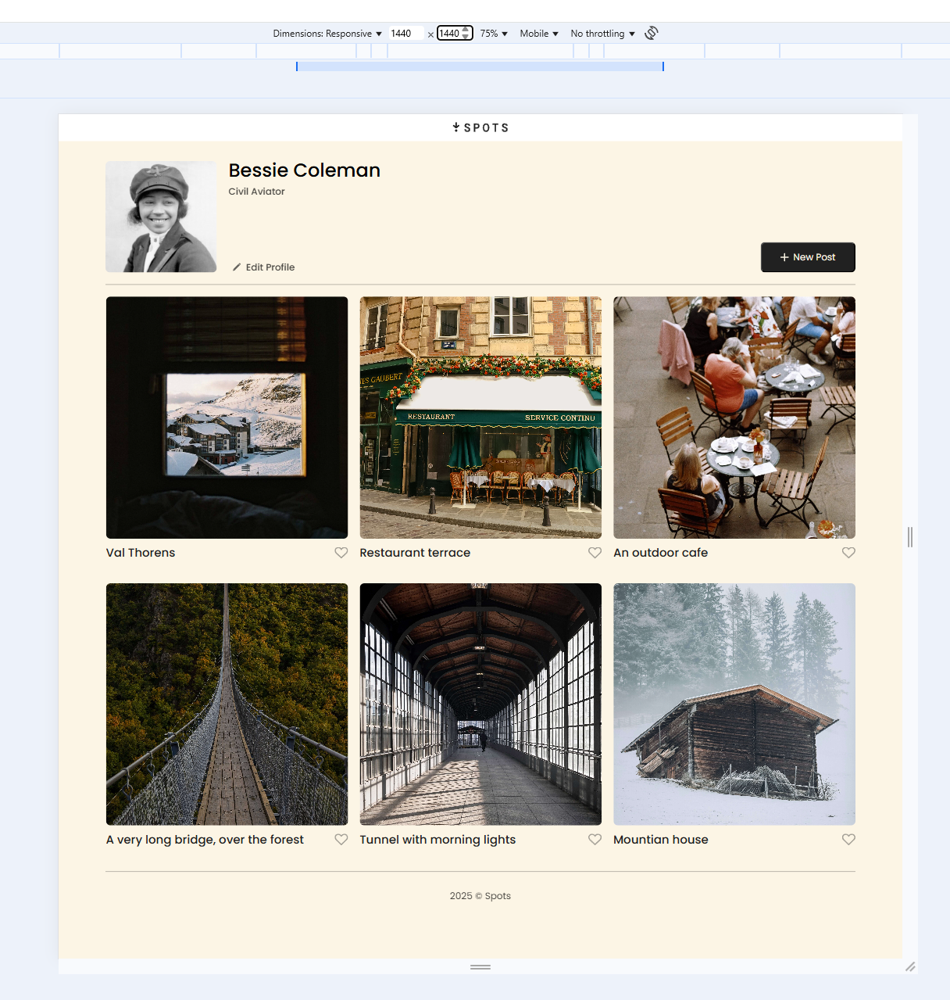
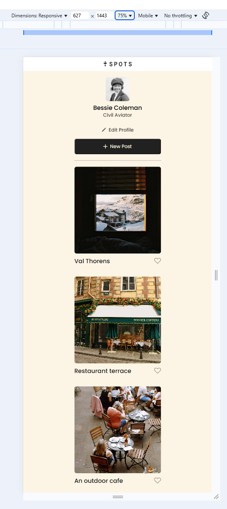
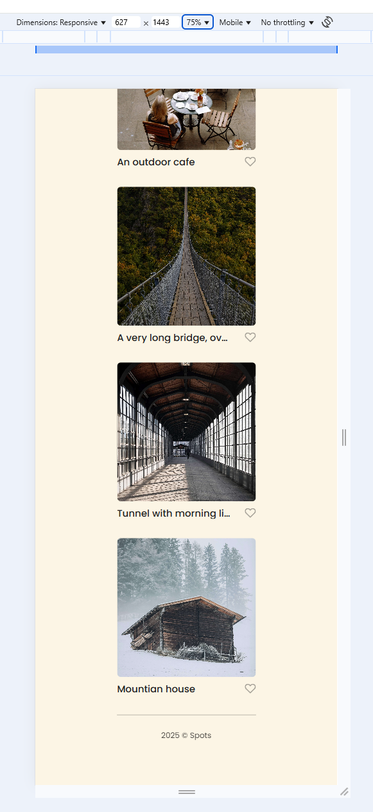
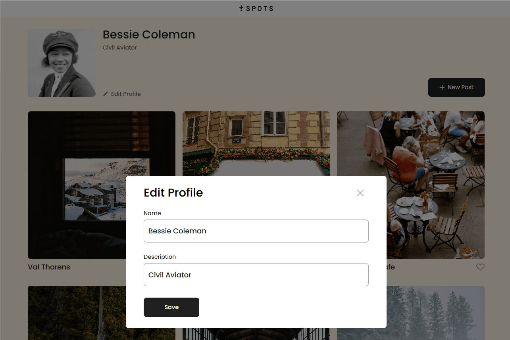
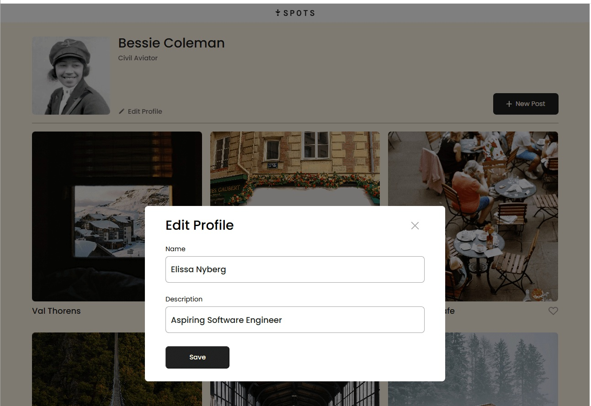
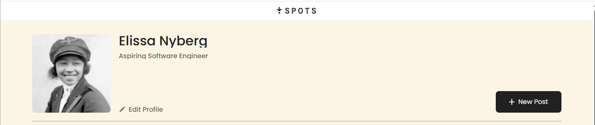
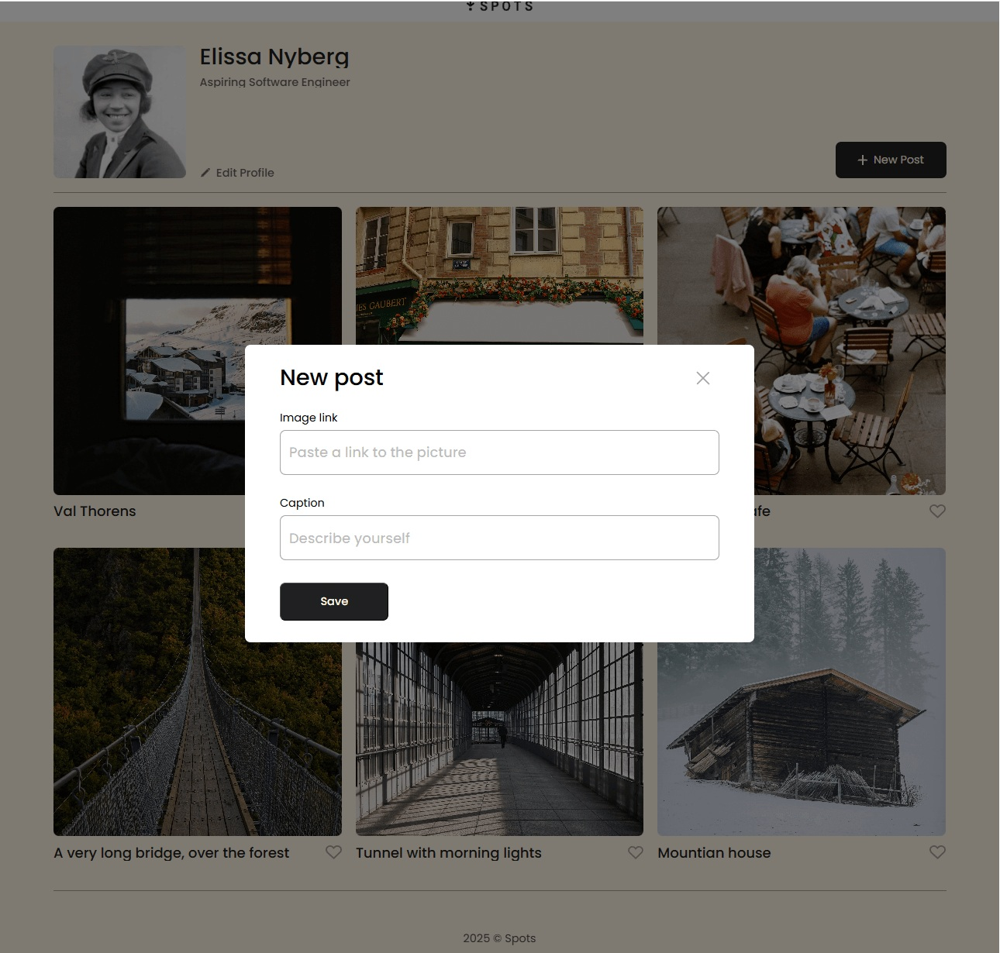
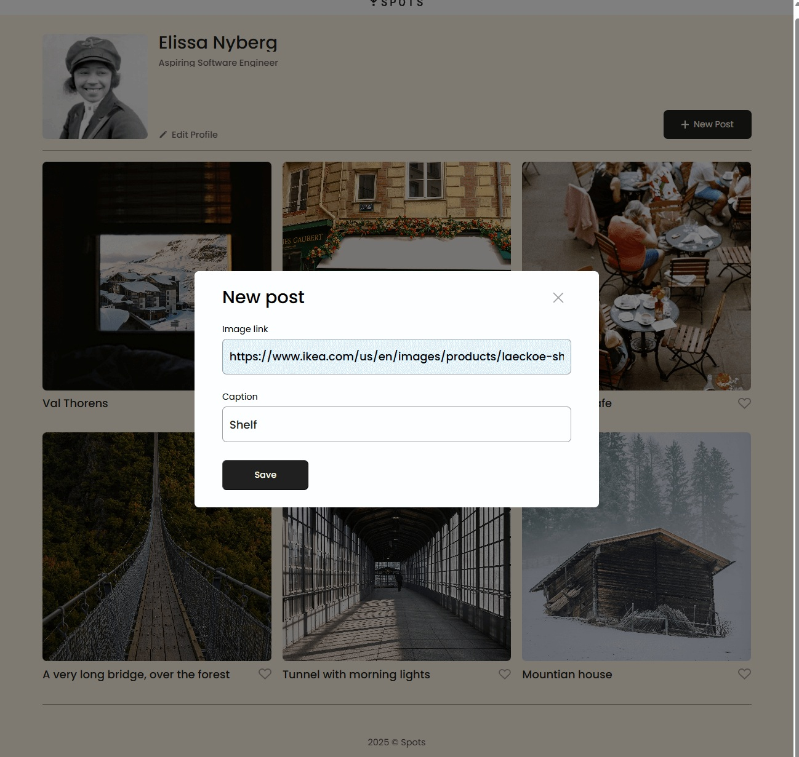
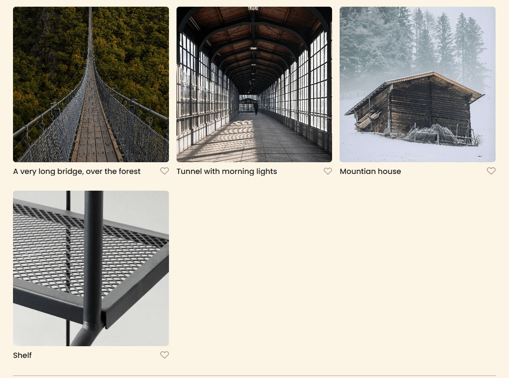
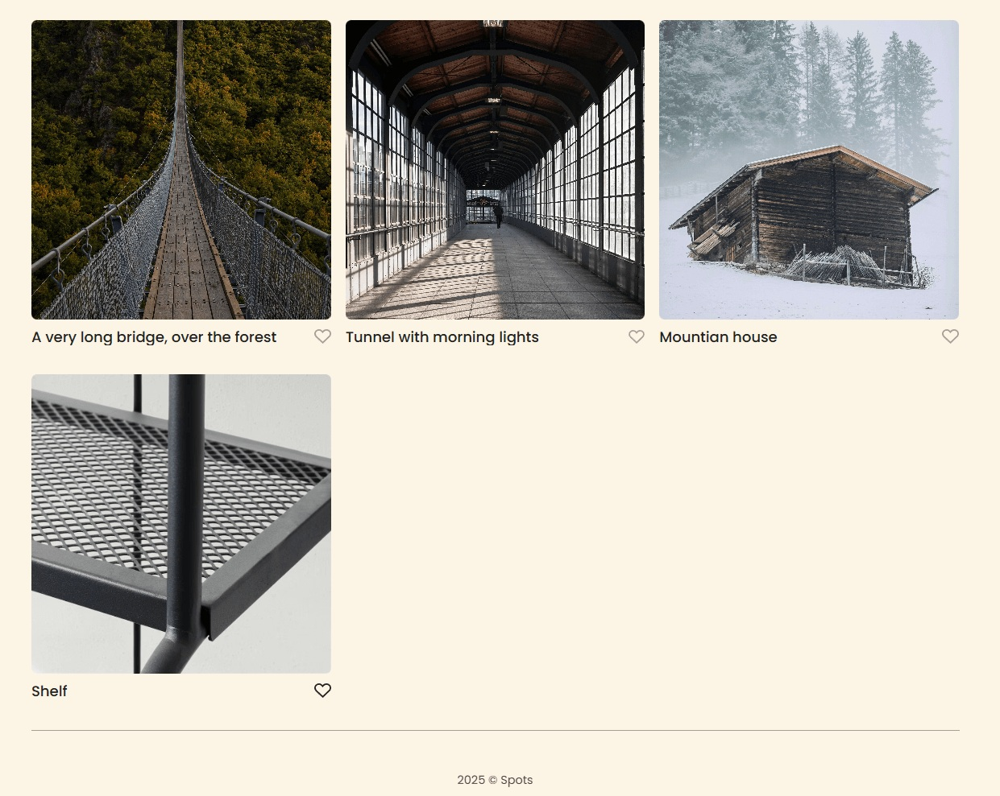

# Spots

## Description

I have finished my third project with TripleTen. This project is called Spots. Spots is a responsive social media web application where users can add and remove photos, like photos, and make profile adjustments

With this project, I was introduced to working with Figma rather than a full brief that gives detailed specifications. I enjoyed the challenge of finding the necessary specifications to recreate the design and how to translate that to code.

## Project Goal

The main goal of this project is to ensure that all elements of the design display correctly across popular screen sizes, such as desktop and mobile. Moving forward, I will be fine-tuning the design to ensure it’s also compatible with tablet devices.

## Project Features

- Responsive layout that adapts to different screen sizes (desktop and mobile)
- Grid-based photo card layout
- Custom fonts implementation

## Tech Stack

In the initial portion of my project, I implemented media queries to help the display be compatible with desktop view and mobile views. Here are the technologies used:

- **HTML**: Structure of the content
- **CSS**: Styling the layout and components
- **Responsive Design**: Ensuring the design is mobile-first and adapts to different screen sizes
- **BEM**: Using Block-Element-Modifier methodology for better CSS organization and maintainability

In the next portion of my project, I implemented JavaScript. By using Javascript, I was able to make the page even more interactive.

- **JavaScript**: Improve interactivity of the page. The edit modal is now opened when clicked. The form is pre-filled with curent profile information. New profile information is saved when submitted. New posts can be created and added to the page without refreshing. New content is structured properly with all necessary elements.

## Screenshots

### Desktop View (1440px)

### Mobile View (627px)

### Edit Profile with Current Info - Before and After

### New Post with Iamge - Before, During, and After

### Spots Functionality Demo

- [Spots Demo](https://photos.app.goo.gl/DB8qWWZDLHhs3dsn9)

## Video Description

- [Video Description Link](https://drive.google.com/file/d/1dnk40vhYClGCO5M5jkFtvc-Ow_wOGXEx/view?usp=sharing)

- [Link to the project on Figma](https://www.figma.com/file/BBNm2bC3lj8QQMHlnqRsga/Sprint-3-Project-%E2%80%94-Spots?type=design&node-id=2%3A60&mode=design&t=afgNFybdorZO6cQo-1)

## Deployment

This webpage is deployed to GitHub pages

- [Deployment link](https://enyberg09.github.io/se_project_spots/)

## Next Steps

- Fine-tuning the layout for tablet devices
- Enhancing performance and improving cross-browser compatibility
