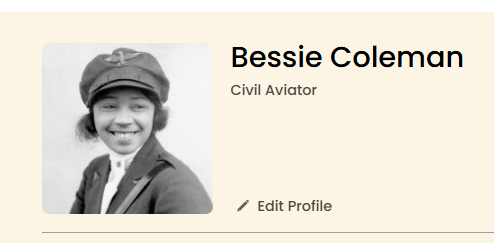
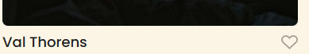
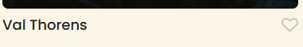
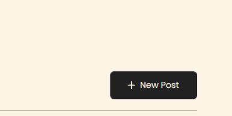
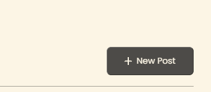

# Spots

## Description

I have finished my third project with TripleTen. This project is called Spots. Spots is a responsive social media web application where users can add and remove photos, like photos, and make profile adjustments

With this project, I was introduced to working with Figma rather than a full brief that gives detailed specifications. I enjoyed the challenge of finding the necessary specifications to recreate the design and how to translate that to code.

## Project Goal

The main goal of this project is to ensure that all elements of the design display correctly across popular screen sizes, such as desktop and mobile. Moving forward, I will be fine-tuning the design to ensure it’s also compatible with tablet devices.

## Project Features

- Responsive layout that adapts to different screen sizes (desktop and mobile)
- Grid-based photo card layout
- Custom fonts implementation

## Tech Stack

In this portion of my project, I have implemented media queries to help the display be compatible with desktop view and mobile views. Here are the technologies used:

- **HTML**: Structure of the content
- **CSS**: Styling the layout and components
- **Responsive Design**: Ensuring the design is mobile-first and adapts to different screen sizes
- **BEM**: Using Block-Element-Modifier methodology for better CSS organization and maintainability

## Screenshots

### Desktop View (1440px)

### Mobile View (627px)

### Edit Profile Button - Before and After

### Like Button - Before and After

### New Post Button - Before and After

## Video Description

- [Video Link](https://drive.google.com/file/d/1dnk40vhYClGCO5M5jkFtvc-Ow_wOGXEx/view?usp=sharing)

- [Link to the project on Figma](https://www.figma.com/file/BBNm2bC3lj8QQMHlnqRsga/Sprint-3-Project-%E2%80%94-Spots?type=design&node-id=2%3A60&mode=design&t=afgNFybdorZO6cQo-1)

## Deployment

This webpage is deployed to GitHub pages

- [Deployment link](https://enyberg09.github.io/se_project_spots/)

## Next Steps

- Fine-tuning the layout for tablet devices
- Enhancing performance and improving cross-browser compatibility
